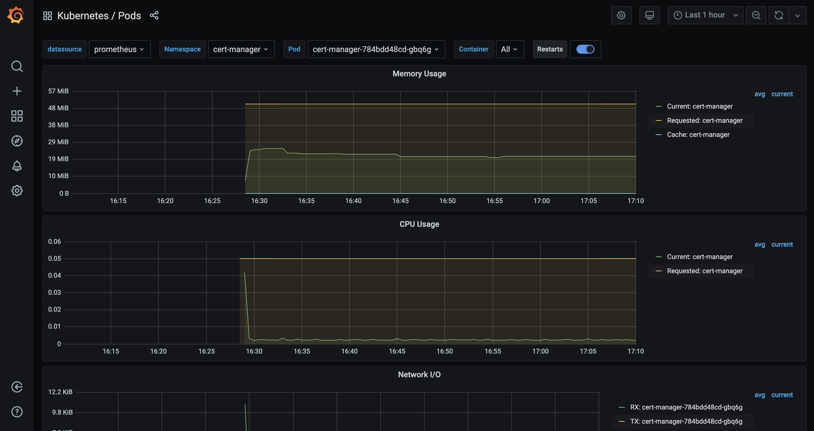

# Fury on Minikube

This step-by-step tutorial helps you deploy the **Kubernetes Fury Distribution** on a local minikube cluster.

This tutorial covers the following steps:

1. Deploy a local minkube cluster.
2. Download the latest version of Fury with `furyctl`.
3. Install Fury distribution.
4. Explore some features of the distribution.
5. Teardown the environment.

> ☁️ If you prefer trying Fury in a cloud environment, check out the [Fury on EKS](../fury-on-eks) tutorial or the [Fury on GKE](../fury-on-gke) tutorial.

## Prerequisites

This tutorial assumes some basic familiarity with Kubernetes.

To follow this tutorial, you need:

- **Minikube** on your local system. Follow the [installation guide](https://minikube.sigs.k8s.io/docs/start/).
- **Docker** - a [Docker image]([fury-getting-started]) containing `furyctl` and all the necessary tools is provided.

## Step 1 - Local provisioning of Cluster with minikube

1. Open a terminal

2. Clone the [fury getting started repository](https://github.com/sighupio/fury-getting-started) containing all the example code used in this tutorial:

```bash
git clone https://github.com/sighupio/fury-getting-started/
cd fury-getting-started/fury-on-minikube
```

3. Start minikube cluster 

```bash
cd infrastructure
make setup
```

> ⚠️ This command will spin up by default a single-node Kubernetes v1.19.4 cluster, using VirtualBox driver: the node has 4 CPUs, 4096MB RAM and 20,000 MB Disk. Please have a look at [Makefile](infrastructure/Makefile) if you need to change some values.
> You can also pass custom parameters, for example:
>
> ```bash
> make setup cpu=2 memory=2048
> ```

4. Run the `fury-getting-started` docker image:

```bash
docker run -ti -v $PWD:/demo docker run -ti -v $PWD:/demo registry.sighup.io/delivery/fury-getting-started
```

## Step 2 - Download fury modules

`furyctl` can do a lot more than deploying infrastructure. In this section, you use `furyctl` to download the monitoring, logging, and ingress modules of the Fury distribution.

### Inspect the Furyfile

`furyctl` needs a `Furyfile.yml` to know which modules to download.

For this tutorial, you can use the following `Furyfile.yml` which is located at `/demo/Furyfile.yaml`:

```yaml
versions:
  monitoring: v1.12
  logging: v1.8
  ingress: v1.10

resources:
  - name: monitoring/prometheus-operator
  - name: monitoring/prometheus-operated
  - name: monitoring/alertmanager-operated
  - name: monitoring/grafana
  - name: monitoring/goldpinger
  - name: monitoring/kubeadm-sm
  - name: monitoring/configs
  - name: monitoring/kube-state-metrics
  - name: monitoring/node-exporter
  - name: logging/elasticsearch-single
  - name: logging/fluentd
  - name: logging/kibana
  - name: ingress/nginx
  - name: ingress/forecastle
```

### Download modules

1. Download the modules with `furyctl`:

```bash
cd /demo/
furyctl vendor -H
```

2. Inspect the downloaded modules in the `vendor` folder:

```bash
tree -d /demo/vendor -L 2
```

Output:

```bash
vendor
└── katalog
    ├── ingress
    ├── logging
    └── monitoring
```

## Step 3 - Installation

Each module is a Kustomize project. Kustomize allows to group together related Kubernetes resources and combine them to create more complex deployment. Moreover, it is flexible, and it enables a simple patching mechanism for additional customization.

To deploy the Fury distribution, use the following `/demo/manifests/kustomization.yaml`:

```yaml
resources:

  # Monitoring module
  - ../vendor/katalog/monitoring/prometheus-operator
  - ../vendor/katalog/monitoring/prometheus-operated
  - ../vendor/katalog/monitoring/alertmanager-operated
  - ../vendor/katalog/monitoring/node-exporter
  - ../vendor/katalog/monitoring/kube-state-metrics
  - ../vendor/katalog/monitoring/grafana
  - ../vendor/katalog/monitoring/goldpinger
  - ../vendor/katalog/monitoring/configs

  # Logging module
  - ../vendor/katalog/logging/elasticsearch-single
  - ../vendor/katalog/logging/fluentd
  - ../vendor/katalog/logging/kibana

  # Ingress module
  - ../vendor/katalog/ingress/nginx
  - ../vendor/katalog/ingress/forecastle

  # Ingress definitions
  - resources/ingress.yml

patchesStrategicMerge:

  - patches/monitoring/alertmanager-operated-replicas.yml
  - patches/monitoring/alertmanager-operated-resources.yml
  - patches/monitoring/prometheus-operated-resources.yml
  - patches/monitoring/prometheus-operator-resources.yml
  - patches/monitoring/grafana-resources.yml
  - patches/logging/fluentd-resources.yml
  - patches/logging/kibana-resources.yml
  - patches/logging/fluentbit-resources.yml
  - patches/logging/elasticsearch-resources.yml
  - patches/ingress/nginx-ingress-controller-resources.yml
```

This `kustomization.yaml`:

- references the modules downloaded in the previous sections
- patches the upstream modules (e.g. `patches/elasticsearch-resources.yml` limits the resources requested by elastic search)
- deploys some additional custom resources (e.g. `resources/ingress.yml`)

Install the modules:

```bash
cd manifest/

make apply
# You will see some errors related to CRDs creation, apply twice
make apply
```

## Step 4 - Explore the distribution

🚀 Now that the distrbution is finally deployed, you can explore some of the features.

### Setup local DNS

To access more easily the ingresses, you will configurure your local DNS to resolve the address of the ingresses to the external minikube IP:

1. Get the address of the cluster IP:

```bash
minikube ip
<SOME_IP>
```

3. Add the following line to your local `/etc/hosts`:

```bash
<SOME_IP> directory.fury.info alertmanager.fury.info goldpinger.fury.info grafana.fury.info prometheus.fury.info

```

Now, you can reach the ingresses directly from your browser.

### Forecastle

[Forecastle](https://github.com/stakater/Forecastle) is an open-source control panel where you can access all exposed applications running on Kubernetes.

Navigate to <http://forecastle.fury.info> to see all the other ingresses deployed, grouped by namespace.


### Kibana

[Kibana](https://github.com/elastic/kibana) is an open-source analytics and visualization platform for Elasticsearch. Kibana lets you perform advanced data analysis and visualize data in various charts, tables, and maps. You can use it to search, view, and interact with data
stored in Elasticsearch indices.

Navigate to <http://kibana.fury.info> or click the Kibana icon from Forecastle.

Click on `Explore on my own` and you should see the dashboard.

#### Create a Kibana index

Open the menu on the right-top corner of the page, and select `Stack Management` (it's on the very bottom of the menu). Then select `Index patterns` and click on `Create index pattern`.

Write `kubernetes-*` as index pattern and flag *Include system and hidden indices*, then click `Next step`.

Select `@timestamp` as time field and create the index.

#### Read the logs

Based on our index, now we can read and query the logs. Let's navigate through the menu again, and select `Discover`.


### Grafana

[Grafana](https://github.com/grafana/grafana) is an open-source platform for monitoring and observability. It allows you to query, visualize, alert on and understand your metrics.

Navigate to <http://grafana.fury.info> or click the Grafana icon from Forecastle.

Fury provides some dashboard already configured to use.

Let's examine an example dashboard. Write `pods` and select the `Kubernetes/Pods` dashboard. This is what you should see:



## Step 6 - Tear down

```bash
# Execute from your local system, outside Docker container
cd infrastructure
make delete
```